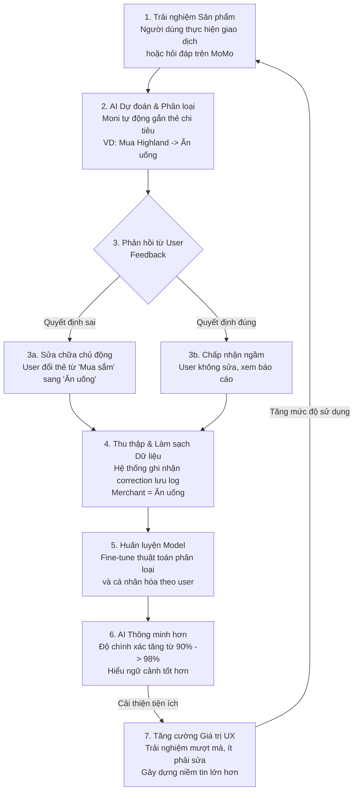

# Thiết kế Data Flywheel cho MoMo — Trợ thủ AI Moni

**Data Flywheel** (Bánh đà dữ liệu) cho tính năng phân loại chi tiêu và trợ lý tài chính Moni của MoMo là vòng lặp liên tục tận dụng tương tác của người dùng để cải thiện trí tuệ nhân tạo, từ đó nâng cao trải nghiệm và thu hút thêm dữ liệu mới.

## Sơ đồ Data Flywheel

## Các Bước Cốt Lõi Trong Vòng Lặp

### 1. Trải nghiệm Sản phẩm (Product Experience)
Người dùng sử dụng MoMo để thanh toán hàng ngày (chuyển tiền, quét QR, thanh toán hóa đơn). Đây là điểm chạm sinh ra dữ liệu thô.

### 2. Dự đoán của AI (AI Prediction)
Ngay khi giao dịch xảy ra, AI Moni tự động phân tích (dựa trên tên cửa hàng, số tiền, thời gian) và gán một nhãn danh mục (VD: `[Ăn uống]`, `[Đi lại]`, `[Hóa đơn]`).

### 3. Phản hồi của Người dùng (User Feedback Loop)
Đây là nguồn sống của Data Flywheel:
- **Explicit Feedback (Phản hồi rõ ràng):** Nếu AI phân loại sai (VD: Mua Steam game bị gắn `[Công việc]`), người dùng sẽ bấm vào để sửa lại thành `[Giải trí]`. Sự điều chỉnh này (Correction) là **dữ liệu vàng (gold data)**.
- **Implicit Feedback (Phản hồi ngầm):** Nếu AI phân loại đúng, người dùng giữ nguyên và dùng báo cáo thu chi. Việc "không làm gì cả" được tính là một xác nhận tích cực (Positive Reinforcement).

### 4. Thu thập Dữ liệu (Data Collection)
MoMo thu thập các nhãn do người dùng điều chỉnh. Ví dụ: Phát hiện hàng nghìn người cùng sửa giao dịch tại "Bách Hóa Xanh" thành `[Đi chợ]` thay vì `[Mua sắm]`. Điều này tạo ra một bộ dataset chất lượng cao được dán nhãn bởi chính cộng đồng (Crowdsourcing).

### 5. Cập nhật Model (AI Model Retraining)
Đưa dữ liệu mới (đã loại bỏ thông tin định danh cá nhân) vào hệ thống để huấn luyện lại (Retrain) hoặc tinh chỉnh (Fine-tune) thuật toán phân loại. AI bắt đầu học được các quy luật cục bộ, thậm chí hiểu thói quen riêng của từng cá nhân (Personalized Model).

### 6. AI Trở Nên Mãi Sắc Bén (Better AI)
Moni giờ đây phân loại chính xác hơn. Những giao dịch tương tự ở Bách Hóa Xanh của những người dùng mới sẽ được gán tự động là `[Đi chợ]` một cách chuẩn xác mà không cần họ phải tự chỉnh.

### 7. Trải nghiệm Tốt hơn, Nhiều Người Dùng Hơn (Better UX & More Users)
Người dùng cảm thấy "Wow, Moni thật thông minh, không cần mình phải động tay". Họ tin tưởng app hơn, kiểm tra báo cáo nhiều hơn và chuyển sang dùng MoMo làm phương thức thanh toán chính. Từ đó, MoMo lại thu hút được thêm **NHIỀU TRANSACTIONS HƠN**, vòng lặp lại quay trở lại Bước 1 với lượng dữ liệu còn khủng khiếp hơn trước.

---

## Ứng dụng để giải quyết vấn đề của Moni hiện tại (Theo bài tập UX)

* **Gỡ bỏ "Ma sát" sửa lỗi (Path 3):** Thay vì bắt user qua 5 bước để sửa (rất mệt mỏi), giao diện (UI) cần cho phép sửa nhanh ngay tại lúc toast notification hiện lên hoặc chỉ bằng 1 chạm kéo thả.
  -> *Việc giảm ma sát giúp AI thu thập được lượng Explicit Feedback dồi dào hơn từ user lười.*
* **Crowdsourced Intelligence:** Thay vì đội ngữ Data tự gán nhãn, hãy để 30 triệu người dùng MoMo dạy AI cách tiêu tiền của người Việt Nam. Flywheel sẽ tự nó lăn.
